## Part 1: Understanding APT & System Updates
1. The APT Version of my system is apt 2.7.14 (amd64) 
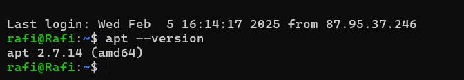
2. Then I updated the package list. It is very important becuase it helps to access latest versions of software , fix the security problem, improve system stability and so on.
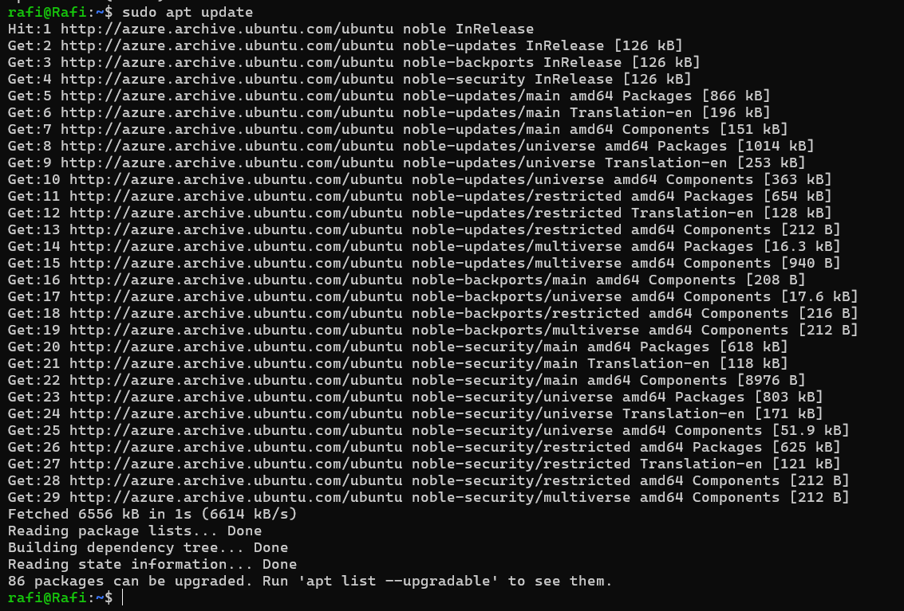
3. Then I Upgrade installed packages. The main difference between update and upgrade is that update command used for refresh the local data package and see if latest version is availabe. And upgrade command used for install that latest version.
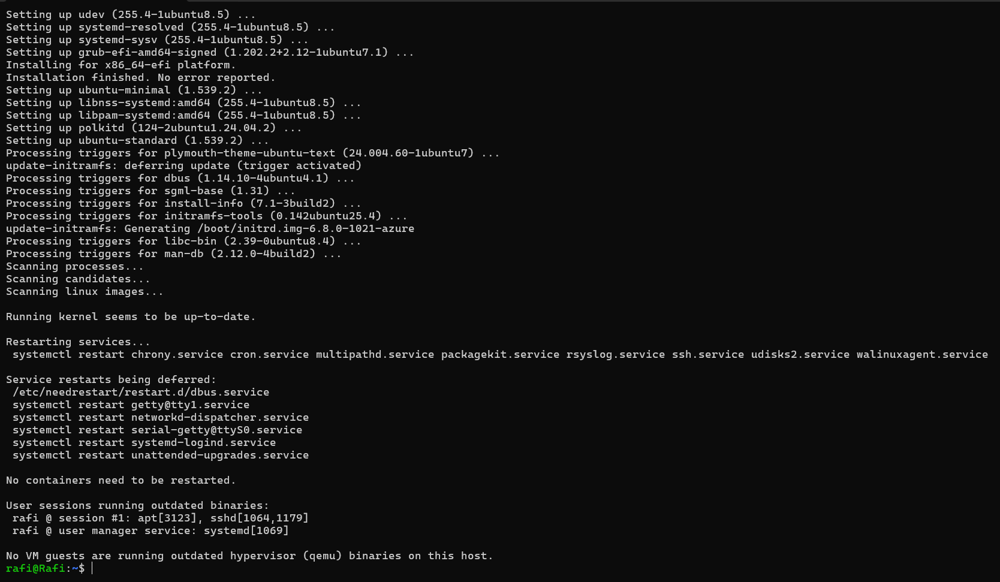
4. Then I view pending updates. There are no pending updates.
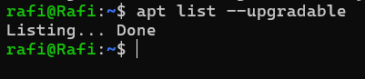
## Part 2: Installing & Managing Packages 
5. There are so many image editor package. So i picked sigil.
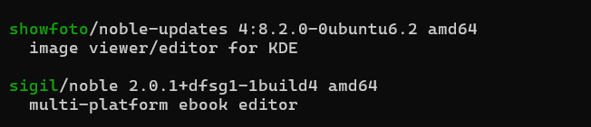
6. sigil require some image processing library such as libhunspell-dev, libjs-jquery-scrollto etc.
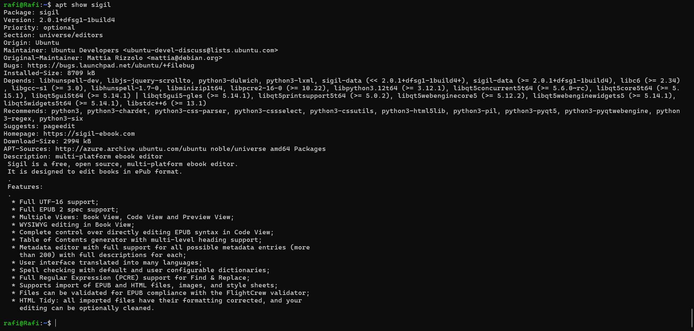
7. Then i install the sigil package. It is successfully installed. 
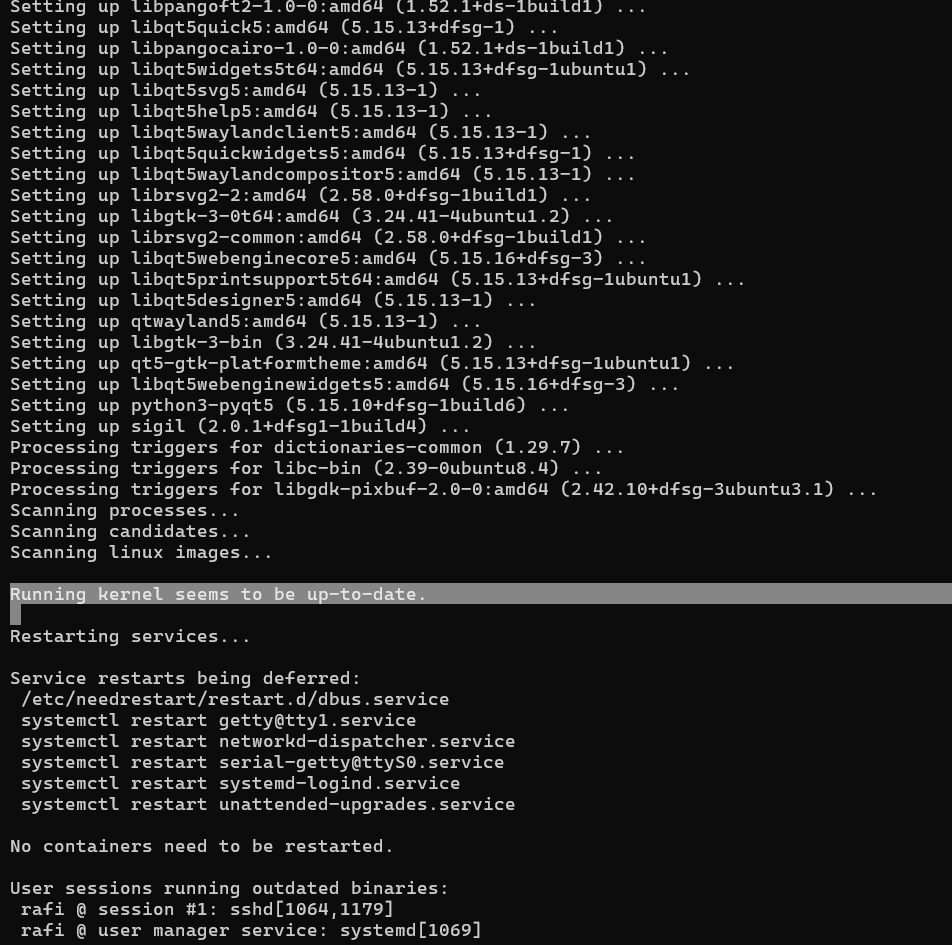
8. sigil  2.0.1+dfsg1-1build4 amd64 version installed.
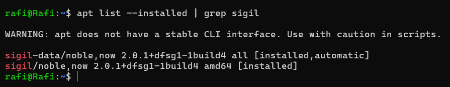
## Part 3: Removing & Cleaning Packages
9. I run the command for uninstall the package but it was not fully removed.
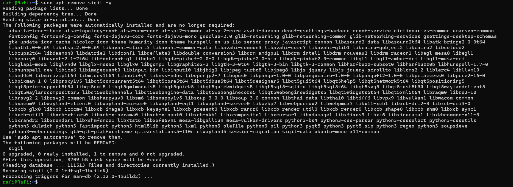
10. The main difference between remove and purge is that remove command uninstall the package but not the configuration file but purge comman do both.
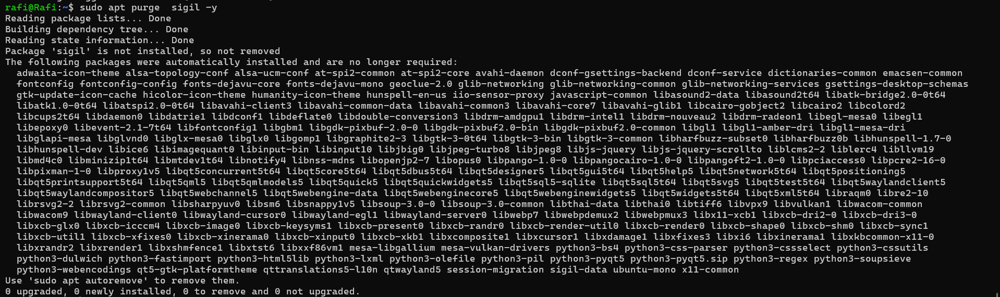
11. Then i remove unnecessary package dependencies. Becuase it will improve my sytem health and also the performance.
12. sudo apt clean command removes cached package files and free some disk space.
## Part 4: Managing Repositories & Troubleshooting
13. After running this command cat /etc/apt/sources.list, there showing that ubuntu sources have been moved and changed the format.
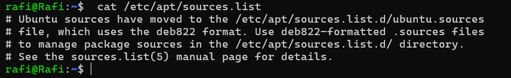
14. There is Hit 1,2,3,4, package availabe in univers repository.
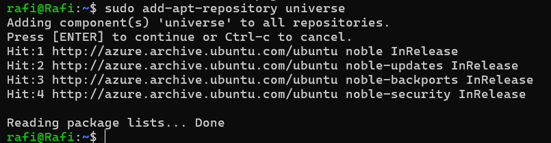
15. Then i try to install fakepackage but the system cannot find the package. For this problem first i have to find is there any package availabe called fakepackage. For the i have to run that command apt search fakepackage. Then it will show if there any package name fakepackage and also the deatils of that. 
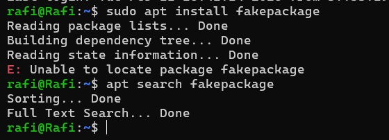