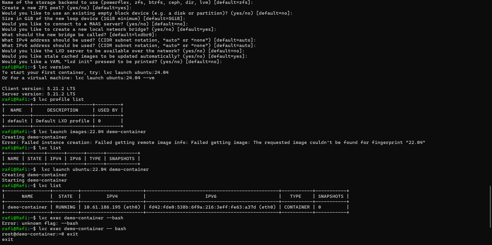
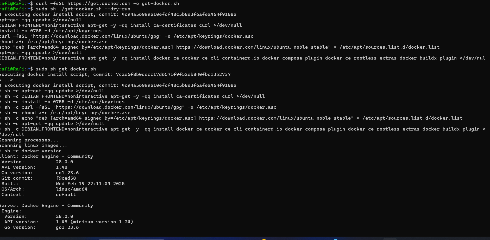
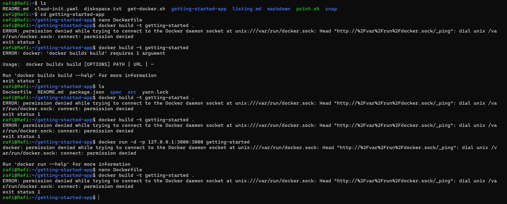
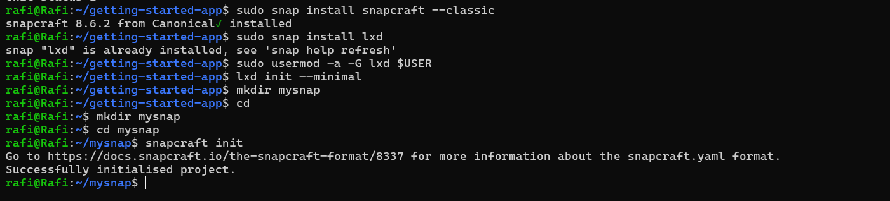
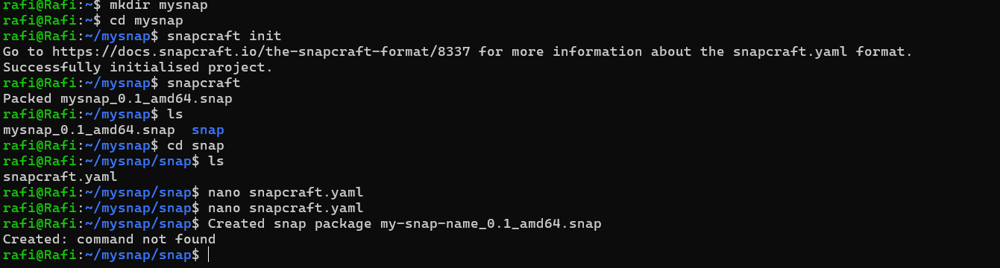

## Part 1:Introduction to virtualization concepts

| 	       | VM       | Containers 
|----------|----------|----------|
| Architecture   | VMs run on a hypervisor, which allows multiple operating systems (OS) to run on a single physical machine  | Containers share the host OS kernel and use container runtimes (e.g., Docker, containerd) to run isolated applications  |
| Resource Utilization   | VMs require more system resources because each instance runs its own OS, consuming significant CPU, memory, and storage   | Containers are more efficient as they share the host OS and only encapsulate application dependencies, leading to lower overhead and faster startup times.   |
| Insulation Levels   | VMs provide strong isolation since each runs a separate OS, making them more secure and suitable for running different OS types on the same hardware.   | Containers have weaker isolation as they share the host OS kernel, increasing the risk of security vulnerabilities but enabling better performance and flexibility. |

## Part 2: Working with Multipass
Cloud-init is an industry-standard way to customize cloud instances at first boot. It supports various Linux distributions, including Ubuntu, CentOS, Debian, and more. Cloud-init allows users to configure networking, install software, manage users, and execute scripts.When a VM starts, cloud-init runs early in the boot process. So, I created a cloud-init configuration file to customize the installation of a new instance.

## Part 3: Exploring LXD 
I created a user in LXD and go to its shell.

## Part 4:How to Stick Apps with Docker
I install the docker engine.

## Part 5:Snaps for Self-Contained Applications
First i install snapcraft using snap command.

