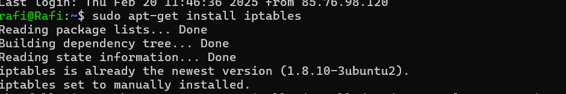
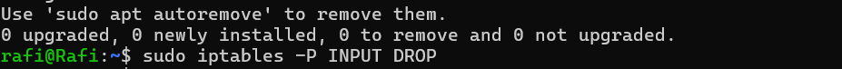
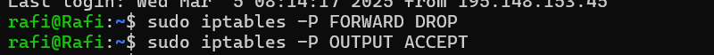
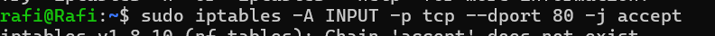
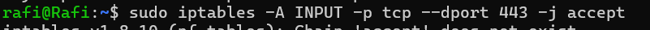
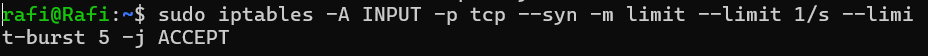
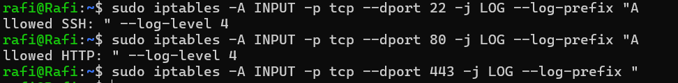
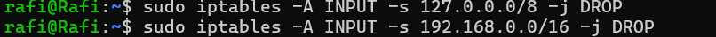

## 1. Install iptables
To create a firewall for the server and ensure it loads when the server starts, i can use iptables on my Linux systems, which is a powerful and flexible tool for managing firewall rules.

## 2. Define Openssh,http and https service
1st i set default policy to drop all incoming and outgoing traffic.

incoming SSH (port 22), HTTP (port 80) and HTTPS (port 443).

## 3. Block connection
To log packets that are being blocked by the firewall, i use the LOG target. This allows me to see in the system logs what traffic is being dropped.In my systeam, there is no entries.

## 4. Prevent SYN Flood
SYN flood attacks are a form of DoS attack where the attacker sends many SYN requests to a server but never completes the handshake, consuming server resources.To prevent this, i can use some rule to limit the rate of incoming connections and allow only legitimate ones.

Also for preventing IP Spoofing, i use some command.

## 5.Definig one rule
From the study and the discussion of common network security issues, one key firewall rule that can be defined is to prevent SYN flood attacks. SYN floods are a type of Denial of Service (DoS) attack where the attacker sends a large number of SYN packets to a target system, often with the intent to overwhelm the server and prevent it from handling legitimate traffic.To prevent SYN flood attacks, i can limit the rate of incoming SYN packets, which are used to initiate TCP connections. A common approach is to use rate-limiting to allow only a limited number of connection attempts in a given time window.

